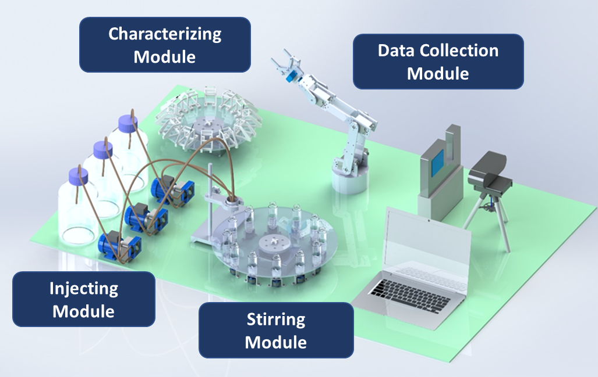

# MuCSL Autonomous Robotic Platform (ARP) Documentations

## 项目简介

该平台旨在减少重复测试，使远程控制能够更准确、更高效地实现实验目标。此外，该设备还能根据以往的观察数据，利用机器学习技术开发和测试新配方。在本项目中，我们小组需要设计和制造自动设备，协助实验人员自动完成**不同液体的注入、液体搅拌、玻璃片镀膜、光学测试和数据存储**。

## 人员构成

**Guoxiong Ma (David):**    
PhD Student, HKUST  
Contact Info: gmaac@connect.ust.hk | 🇭🇰(+852) 69720901 | 🇨🇳(+86) 18610286670

**Haozhe Cui (Eric):**           
MPhil Student, HKUST  
Contact Info: hcuiad@connect.ust.hk | 🇭🇰(+852) 69314725 | 🇨🇳(+86) 19518736691

**Chun Yin YIP (Aaron):**  
MPhil Student, HKUST  
Contact Info: cyyipai@connect.ust.hk | 🇭🇰(+852) 67712998 | 🇨🇳(+86) 13980060979

## 相关链接

- [MuCSL 实验室](https://mucslab-dev.hkust.edu.hk/)
- [ARP Control - GitHub Page](https://github.com/Ericc99/RoboticPlatform)
